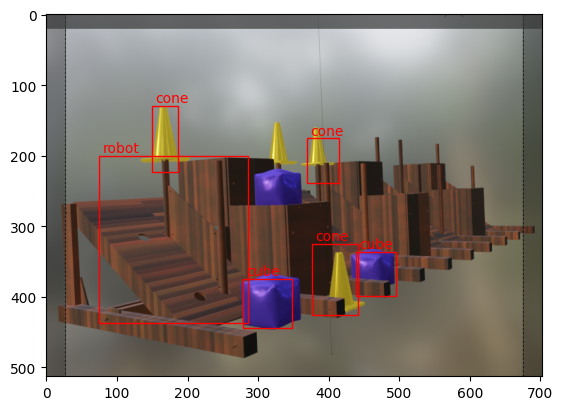

# detecto-example
Example Jupyter Notebook for Detecto Pytorch Library

## How to use
- [Open the ipynb in Google Collab](https://colab.research.google.com/drive/1X9khkGBvpFfWKFA1XPEN5oNTiRg6DpHY?usp=sharing)
- Upload the shadedmodel.png
- Upload the model_cone_cube_50_epoch_60_percent.pth model
- Run everything in the notebook EXCEPT training

## Results
Not so great predictions, but a good start!
